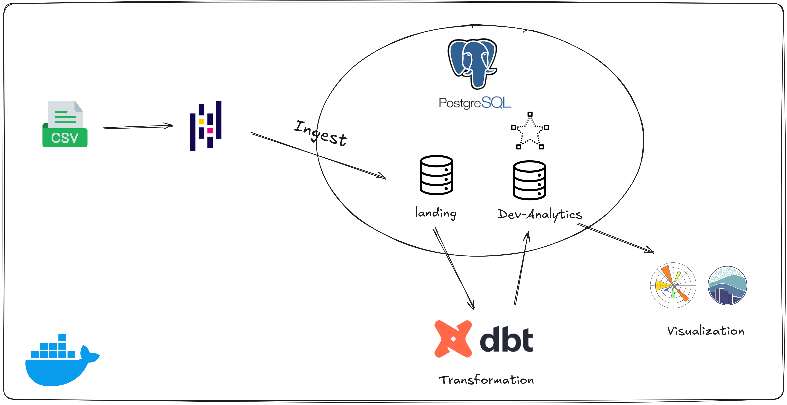
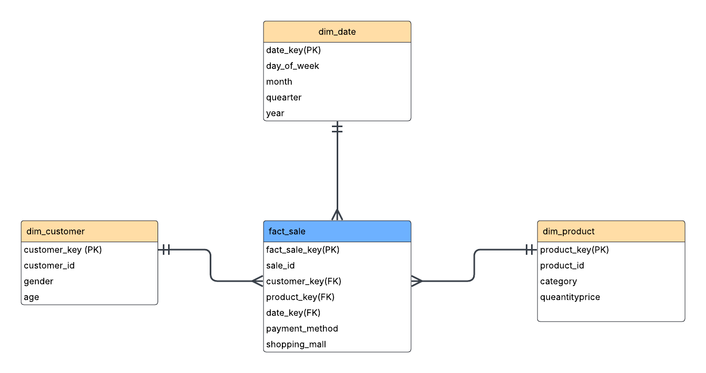

## Architecture 

## Tech Stack 
* DBT 
* Docker
* SQL
* Python 

## Project Overview 
The goal of this project is to build an ETL pipeline that extracts, transforms, and loads data into a PostgreSQL database for analytics and visualization. Raw data is ingested into a landing zone, transformed using dbt to create structured dimension and fact tables, and tested in a Dev schema before deployment to Prod. The final data is visualized to support data-driven decision-making, ensuring a reliable and efficient process from ingestion to insights.

## Data model 

